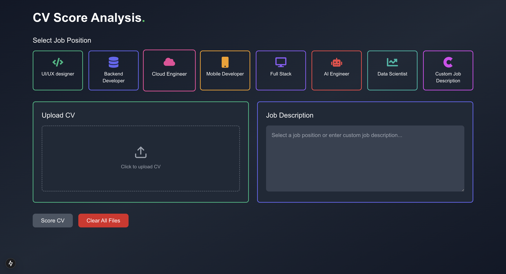
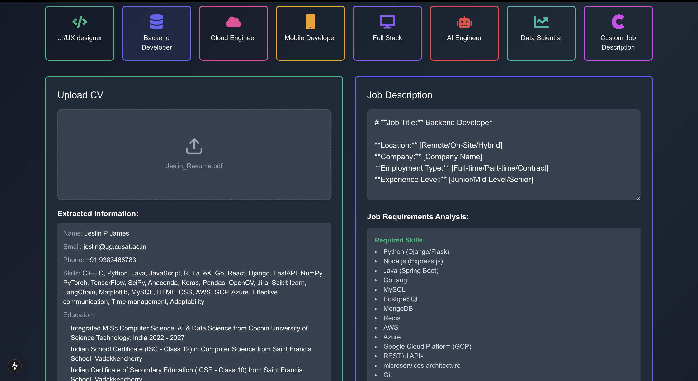
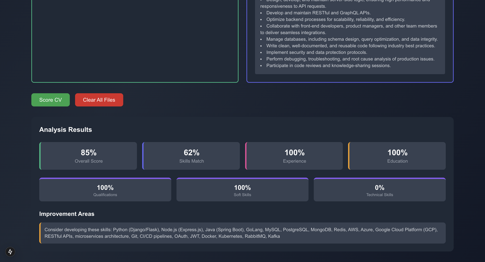

# Interviewme🎯

---

## Basic Details


---

## Project Description

Developed an intelligent system that evaluates and scores resumes against job descriptions using advanced Natural Language Processing (NLP) techniques. The system employs Semantic Search to understand contextual relevance, Named Entity Recognition (NER) to extract key details like skills, experience, and qualifications, and Similarity Search to compare resume content with job requirements. The final score is calculated using a Weighted Average Model, ensuring key criteria such as skills, experience, and education are appropriately prioritized. Additionally, the model provides personalized feedback to candidates, highlighting strengths and areas for improvement. This project streamlines recruitment by automating resume screening and enhancing candidate-job alignment through data-driven insights.

---

## Technical Details

### Technologies/Components Used

**Languages:**
<div style="display: flex; align-items: center; gap: 20px; margin-bottom: 20px;">
    
    
    
    
</div>

**Frameworks/Libraries:**
<div style="display: flex; align-items: center; gap: 20px; margin-bottom: 20px;">
    
    
    
</div>

**Tools:**
<div style="display: flex; align-items: center; gap: 20px; margin-bottom: 20px;">
    
    
    
    
    
</div>

---

## Run

# 🚀 Project Setup Guide

A step-by-step guide to set up and run your project seamlessly.

---

## 📚 Prerequisites

Ensure the following tools are installed on your system:

- [Go (latest version)](https://go.dev/doc/install)  
- [Node.js (latest version)](https://nodejs.org/)  
- [npm (Node Package Manager)](https://www.npmjs.com/)  
- [Next.js](https://nextjs.org/docs/getting-started/installation)  

---

## 🛠️ Installation Steps

### 1. Clone the Repository

Clone the project to your local machine:

```bash
git clone <your-repository-url>
cd <your-repository>

---


---

## Project Documentation

### Screenshots

  
*Model when no smile: "huh"*

  
*Model with weird expression: "nahuh"*

  
*"Bro, that smile: 10/10!"*


## Team Contributions

- **Nabeel Nazeer**

---


# InterviewMe - Resume Scoring Platform


A modern web application that helps users score and evaluate resumes using various scoring techniques and algorithms.


### Frontend
- Next.js 13+ (React Framework)
- TypeScript
- Tailwind CSS
- shadcn/ui Components

### Backend
- Go 1.20+
- Fiber (Web Framework)
- GORM (ORM)


---

Made with ❤️
